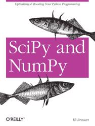

## NLP, Computational linguistics
|               |               |
| ------------- |:-------------:|
|  | [Kulkarni Akshay, Shivananda Adarsha: Natural Language Processing Recipes](https://github.com/olegzinkevich/programming_books_notes_and_codes/tree/main/akshay_natural_language_processing)  |

## Statistics, data science
|               |               |
| ------------- |:-------------:|
| | [Eli Bressert: SciPy and NumPy](https://github.com/olegzinkevich/programming_books_notes_and_codes/tree/main/numpy_bressert) |

## Testing
|               |               |
| ------------- |:-------------:|
|  | [David Sale: Testing Python: Applying Unit Testing, TDD, BDD and Acceptance Testing](https://github.com/olegzinkevich/programming_books_notes_and_codes/tree/main/testing_david_sale)  |
