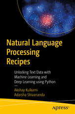

In the repository [programming_books_notes_and_codes](https://github.com/olegzinkevich/programming_books_reviews_and_codes) you'll find notes and code samples from the books I enjoyed reading and which I can recommend for personal study.

---

## Kulkarni Akshay, Shivananda Adarsha: Natural Language Processing Recipes: Unlocking Text Data with Machine Learning and Deep Learning using Python.
> - Natural language processing techniques.
> - Text classification.
> - Topic modeling.
> - Text summarization.
> - Text generation.
> - Entity extraction.
> - Sentiment analysis.

