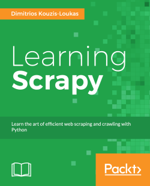

In the repository [programming_books_notes_and_codes](https://github.com/olegzinkevich/programming_books_reviews_and_codes)  you'll find notes and code samples from the books I enjoyed reading and which I can recommend for personal study.

---

## Dimitrios Kouzis-Loukas: Learning Scrapy

> Scrapy fundamentals
> Data extraction
> Storing the scrapped data in databases

