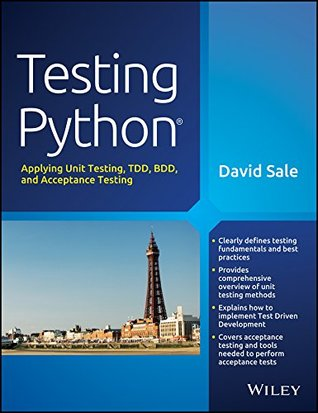

In the repository [programming_books_reviews_and_codes](https://github.com/olegzinkevich/programming_books_reviews_and_codes)  you'll find notes and code samples from the books I enjoyed reading and which I can recommend for personal study.

## David Sale: Testing Python: Applying Unit Testing, TDD, BDD and Acceptance Testing.
---
> - Testing fundamentals and best practices.
> - Comprehensive overview of unit testing methods.
> - How to implement test driven development.
> - Acceptance testing.

